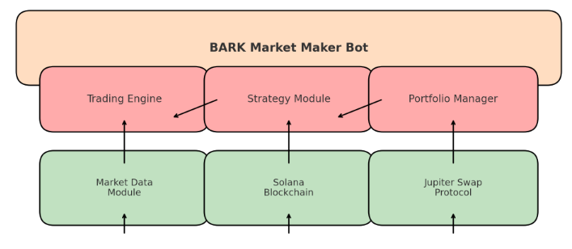

# BARK Market Maker Bot

The **BARK Market Maker Bot** automates trading strategies on the Solana blockchain using the Jupiter swap protocol. Its primary goal is to maintain a balanced portfolio across token pairs such as BARK, SOL, and USDC by executing trades based on predefined strategies and market conditions.

## Table of Contents

- [Introduction](#introduction)
- [Features](#features)
- [Architecture](#architecture)
- [Installation](#installation)
- [Configuration](#configuration)
- [Usage](#usage)
- [Strategies](#strategies)
- [Safety and Security](#safety-and-security)
- [Contributing](#contributing)
- [Disclaimer](#disclaimer)
- [License](#license)

## Introduction

The BARK Market Maker Bot provides:
- **Smooth Trading Experience:** Reduces slippage and ensures efficient order execution.
- **Automatic Liquidity Provision:** Continuously provides liquidity and manages spread.
- **Portfolio Balancing:** Maintains a balanced portfolio among specified tokens.

## Features

- Automated trading with minimal manual intervention
- Real-time market data access
- Integration with Solana blockchain and Jupiter swap protocol
- Configurable risk management
- Predefined and customizable trading strategies

## Application

Express application with TypeScript

## Architecture

The bot consists of the following components:

- **Trading Engine:** Core module for executing trades based on strategies.
- **Market Data Module:** Fetches real-time market data.
- **Strategy Module:** Contains and executes trading strategies.
- **Portfolio Manager:** Manages token holdings and balance.
- **Solana Blockchain Integration:** Interfaces with Solana for transactions.
- **Jupiter Protocol Adapter:** Manages token swaps and liquidity.

**Diagram:**



## Installation

### Prerequisites

- **Node.js** (v16 or higher)
- **Solana CLI**: For interacting with the Solana blockchain.
- **Jupiter SDK**: For swaps with the Jupiter protocol.
- **Git**: For cloning the repository.

### Steps

1. **Clone the Repository:**

   ```bash
   git clone https://github.com/username/BARK-Market-Maker-Bot.git
   ```

2. **Install Dependencies:**

   ```bash
   cd BARK-Market-Maker-Bot
   npm install
   ```

3. **Configure Environment:**

   Create a `.env` file in the root directory with the following content:

   ```env
   SOLANA_NETWORK=mainnet-beta
   JUPITER_API_KEY=your-jupiter-api-key
   TRADING_PAIRS=BARK,SOL,USDC
   BARK_KEYPAIR_PATH=/path/to/bark-keypair.json
   ```

4. **Run the Bot:**

   ```bash
   npm start
   ```

## Configuration

### Environment Variables

- **SOLANA_NETWORK:** Solana network (e.g., `mainnet-beta`, `devnet`).
- **JUPITER_API_KEY:** API key for Jupiter protocol.
- **TRADING_PAIRS:** Comma-separated list of trading pairs (e.g., `BARK,SOL,USDC`).
- **BARK_KEYPAIR_PATH:** Path to the BARK keypair JSON file.

### BARK Keypairs

**Generate a BARK Keypair:**

```bash
solana-keygen new --outfile /path/to/bark-keypair.json
```

**Configure the Bot:**

Set `BARK_KEYPAIR_PATH` in the `.env` file to the path of your keypair file.

## Usage

1. **Start the Bot:**

   ```bash
   npm start
   ```

2. **Monitor Performance:**

   Check logs for updates on trades and portfolio status.

3. **Adjust Strategies:**

   Modify `src/strategies/basicMM.ts` to customize trading behavior.

## Strategies

### Basic Market Maker (basicMM)

- **Bid-Ask Spread:** Place buy orders below and sell orders above the current market price.
- **Inventory Management:** Adjust order sizes based on holdings and desired balance.
- **Dynamic Pricing:** Update order prices based on market movements.

**Configuration:**

Edit `src/strategies/basicMM.ts` to define:
- **Spread Percentage**
- **Order Size**
- **Risk Management**

### Other Strategies

- **Mean Reversion:** Buy low, sell high based on moving averages.
- **Momentum Trading:** Buy into upward momentum.
- **Arbitrage:** Exploit price differences across exchanges.

**Implementation:**

Edit `src/strategies/strategies.ts` to define and implement strategies.

## Safety and Security

- Always review the code and understand the strategy before enabling live trading.
- Start with small amounts to test the bot's performance and behavior.
- Keep your Solana wallet keypair file secure and never share it with anyone.

## Contributing

Contributions are welcome! Please follow these steps:

1. Fork the repository.
2. Create a new branch (`git checkout -b feature-branch`).
3. Make your changes and commit (`git commit -am 'Add new feature'`).
4. Push to the branch (`git push origin feature-branch`).
5. Open a Pull Request.

## Disclaimer

This project is for educational and experimental purposes only. Use it at your own risk. The authors are not responsible for any financial losses or damages.

## License

The MIT License. See the [LICENSE](LICENSE) file for details.

